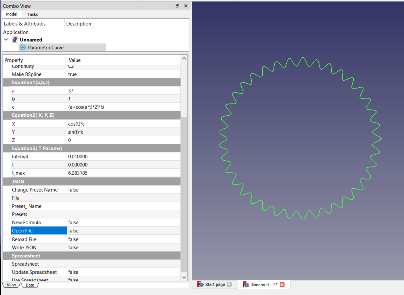

# Parametric_Curve_FP
Create a parametric curve feature python object in FreeCAD

Toolbar icon: 

## Installation
Install using the Addon Manager in the Tools menu from the Macros tab.

## History
This macro is based on the FreeCAD macro 3D Parametric Curve by Lucio Gomez and Laurent Despeyroux.  https://wiki.freecadweb.org/Macro_3D_Parametric_Curve
The difference is this macro creates a feature python object that also has spreadsheet and JSON integration capabilities.

## Usage
Run the Make_Parametric_Curve.py file as a macro to create the feature python object.  Then modify the properties to setup the formula to use.  It comes with a default formula to create a curve pictured above

You can also, in addition to modifying the properties directly, elect to use a spreadsheet to hold the formulas or read them in from a previously created text file in JSON format.  A spreadsheet needs to have the following aliases defined:

* a_cell -- String that contains the a formula.
* b_cell -- String that contains the b formula.
* c_cell -- String that contains the c formula.
* [optional] d1,d2,d3,d4, etc. -- d formula held as string list in Property "d".
* X -- String that contains the X formula.
* Y -- String that contains the Y formula.
* Z -- String that contains the Z formula.
* t_min -- Floating point that contains the starting value of t.
* t_max -- Floating point that contains the ending value of t.
* interval -- Floating point that contains the step value for t as it goes from t_min to t_max.

The feature python object can add these aliases for you to an existing spreadsheet or a new spreadsheet that it can also create.  If there is no spreadsheet linked in the Spreadsheet property and you set the Update Spreadsheet property to True, the fp object will create the new spreadsheet, link it to itself, and add the aliases to the spreadsheet.  It also sets the Use Spreadsheet property to True.  If you manually select a spreadsheet by editing the Spreadsheet property to link to an existing spreadsheet, and that spreadsheet does not contain the required aliases you will be asked whether to create them or not.  Doing this will clobber any existing data in cells A1 through B9.

You can save the fp object's state (the Equation Group and JSON group properties) to the JSON file, and then later load them back from the JSON file in this or in another Parametric Curve object.  With JSON files you are able to have more than one formula per file, unlike spreadsheets, which are limited to one formula per spreadsheet.  If you have many formulas you like to use you can save them all to a single JSON file.

Sample JSON file:
<pre>
{"coil": {"a": "6", "b": "1", "c": "20", "d": [], 
"X": "(a + b * cos(c*t))*cos(t)", "Y": "(a + b * cos(c*t))*sin(t)", "Z": "b*sin(c*t)", 
"t": "0.0", "t_max": "6.283185307179586", "interval": "0.02"},

"holesaw": {"a": "12", "b": "6", "c": "5.000000", "d": [], 
"X": "cos(t)*a", "Y": "sin(t)*a", "Z": "c*sin(b*t)", 
"t": "0.0", "t_max": "6.283185307179586", "interval": "0.1"},

"amoeba": {"a": "36.3", "b": "12 #number of elements", "c": "1.5", "d": ["(a+c*sin(b*t))"], 
"X": "cos(t)*d1", "Y": "sin(t)*d1", "Z": "0", 
"t": "0.0", "t_max": "6.283185307179586", "interval": "0.1"}, 

"sawtooth": {"a": "40", "b": "10", "c": "0.8", "d": ["mod(b*t, 1)", "10"], 
"X": "a*cos(2*pi*t)", "Y": "a*sin(2*pi*t)", 
"Z": "d2*(lt(d1,c)*d1/c + gte(d1,c)*(1-d1)/(1-c))", 
"t": "0.0", "t_max": "1.0", "interval": "0.01"}}
</pre>

You can manually edit the JSON files in a text editor, but there are a few things to keep in mind.
* Make sure to follow the formatting properly or else the fp object will not be able to read the file
* Values for min_t, max_t, and interval must evaluate directly to float.  For example, "3.14159" works, but "pi" does not.
* All values must be strings (in quotes)

## Properties

The Feature Python object (ParametricCurve) has a number of properties separated into different groupings.

### Curve Group
#### Closed (Default: False)
The property sets the curve to either closed or not closed.  If it's set to True the wire will close itself (connect the first vertex to the last vertex).  This is sometimes  required if you are to use the curve to create a solid with a Pad, Extrude, etc.  THis was set to True by default, but since 0.2022.02.13 it is now False by default.  This is because OCC can sometimes fail if this is True and the first and last points are coincident already.
#### Shape Type (Default: BSpline)
Choose your shape type here.  Options are: BSpline, Polygon, Points.
#### PlusOneIteration (Default: True)
Fixes a bug by adding one more iteration to the loop.  But if this causes a problem with an existing model, this can be set to False to keep the current (buggy) behavior.
#### Points
This is a list of vectors used to create the output shape.  Note: if Shape Type is "Polygon" and Closed = True, the first point is also copied to the end of the points list.
#### Version
This gives the version used to create this object (not necessarily the same as currently installed.)  It is in the form of the date of last modification, e.g. 2021.08.27.
#### Continuity
Gives you the Continuity property of the Curve.  This is a readonly property for information only.
### Spreadsheet Group
When a spreadsheet is linked and the Use Spreadsheet property is set to True, all of the feature python object's equation properties become readonly.  You must modify them in the spreadsheet instead.  Use Spreadsheet will create a new spreadsheet, add aliases, set them to the current formula's values, and link it if one is not already linked.  Update Spreadsheet will push the current formula to the spreadsheet, overwriting any existing values in cells A1-B9.  If Use Spreadsheet is set to True, any changes to the spreadsheet are automatically reflected in the related feature python property.
#### Spreadsheet (Default: None)
This is a link property, linking the fp object to a spreadsheet.  By default, it is empty, but if you select a spreadsheet in the tree view, and then run the macro to create the fp object, it will link that spreadsheet automatically and import the data into the properties.  See Usage section above for more details on required format of spreadsheet.
#### Update Spreadsheet (Default: False)
[Trigger] This property serves as a command button.  When you set it to True it triggers the fp object to save the properties to the connected spreadsheet, overwriting any existing values.  If no spreadsheet is connected it will create a new spreadsheet for you, link it in the Spreadsheet property, add the required aliases, and set their values.  It's a way of saving the current properties to a new spreadsheet for later use.  In all other cases the fp object pulls values from the connected spreadsheet (if Use Spreadsheet = True, see below), but in this case it is pushing those values to the spreadsheet.  After it pushes the data to the spreadsheet it resets itself back to False.
#### Use Spreadsheet (Default: False)
When this is True, the formula properties (a,b,c,d,X,Y,Z,t,t_max, and interval) are all set to readonly.  You won't be able to modify the properties in the fp object's property view when this is True.  Instead, you must modify the appropriate cells in the spreadsheet.  The fp object automatically updates its properties from the spreadsheet when they change.  Set this to False if you would prefer to modify the properties in the fp object rather than in the spreadsheet.  But if you set it to True again your property changes will be overwritten with the values from the spreadsheet.  Use the Update Spreadsheet property/command trigger to push the data to the spreadsheet first if you don't want the property values to be clobbered.
### JSON Group
You can link a text file to the feature python object.  In such a text file you can save/load formulas in JSON format.  Note: merely linking the file does nothing but set the file name in the File property.  You must then trigger the Read File property to read in the contents (which will overwrite existing formulas).  If you want to save your current formula to the file first, then use the Append File command to append the current formula to the JSON file before reading it in.
#### Formula Name
This is the name of the current formula.  It is a string property that you can modify.  But modifying it alone does not change the name of the currently selected formula.  You must trigger the Rename Formula property (see below).
#### Rename Formula
[Trigger]  This property serves as a trigger to trigger a command.  The command triggered is to change the name of the current formula (as currently selected in the Formulas property) to the string currently in the Formula Name property field.  By default, when a new formula is created (or when a new JSON file is initiated) the default name given to it is "formula" or sometimes "formula1", "formula2", etc.  If you want to change the name to something more meaningful, such as "Spiral", enter "Spiral" into the Formula Name property and trigger the Rename Formula property from False to True.  Note: You must connect a JSON file to the feature python object using the File property, discussed below, before you can use all of the features in the JSON group.
#### File
This is the JSON file connected to the fp object.  It is essentially a text string containing the path to the linked file.  By default, it is empty.  You can click the "[...]" button to open the file open dialog to select a file or create a new one by entering the name into the File property field.  Make sure you have write access to the folder you choose.  In Linux something like ~/Documents/myjsonfile.txt would work.  In Windows, maybe use c:\users\YOURUSERNAME\Documents\myjsonfile.txt.  When you connect the file it is not automatically read in.  You must toggle Read File property to read in the data.  This is to allow you to append current data to the file before reading it in.

A JSON file may have more than one formula stored in it.  Each formula is given a name, e.g. formula, formula2, etc.  Or you can assign your own custom name if you prefer.  All of the formulas get populated into the Presets property when you read the file, which presents as a drop down list from which you can select the desired formula.
#### New Formula
[Trigger]  This property serves as a trigger to trigger a command.  The command triggered is to create a new formula and add it to the Presets property.  It is given a default name, such as "formula", "formula2", "formula3", etc., whichever one is first available.  You can change this name to a more meaningful one as described above im the Rename Preset documentation.  All of the Trigger properties are boolean properties that are normally False.  You trigger them by setting them to True.  They reset themselves to False after running the command.
#### Delete Formula
[Trigger] Deletes the currently selected preset.  It does not modify the linked JSON file.  You must trigger Write File or Append File to make changes to the file (or edit it manually outside FreeCAD -- see Open File below).
#### Open File
[Trigger]  This property serves as a trigger to trigger a command.  The command triggered is to open the JSON file in your default editor.  If you give it a .txt extension this is more likely to be successful.  It has been tested on Windows and Ubuntu, but not as yet on Mac.  The JSON file can be edited as you would any text file.  Just take care to follow the formatting if adding new formulas in this manner.  Once you have edited and saved your changes you can have the fp object reload the file by triggering the Read File property.
#### Read File
[Trigger]  This property serves as a trigger to trigger a command.  The command triggered is to read or reload the JSON file from disk in the event changes have been made to the file outside of the fp object or in the case where you simply want to reset the fp object to the contents of the file.
#### Write File
[Trigger]  This property serves as a trigger to trigger a command.  The command triggered is to save the current formulas to the JSON file.  Everything in the JSON file will be overwritten.  Use Append File if you just want to add to the file the current formula.  You must trigger this command in order to save any changes to the JSON file unless you made the changes outside the fp object, such as using Notepad in Windows.  
#### Append File
Append formulas to the linked JSON file.  If there is already a formula with the same name in the file, then it is skipped and a warning shown in the report view.  You will need to rename any formulas with conflicting names.

### Equation1 and Equation2 Groups
String variables: a, b, c, d1-dN, X, Y, and Z may contain python style comments.  These begin with a pound symbol (#).  The # and the rest of the line are ignored by the evaluation mechanism.  For example, a value for a could be 12 #radius.  In such a case only the 12 is evaluated, not the # or anything following it.
#### a,b,c,d,X,Y,Z
These are string properties that hold the formulas for creating the curve.  Math expressions, like cos(), sin(), atan(), etc. can be used in the formulas.  Basically, anything in the math package, such as math.pi can be used (use it as simply pi and not as math.pi).  In all of these you can refer to t.  For property a you cannot refer to b or c (because these variables haven't been created yet).  In b you can refer to a, but not c.  In c you can refer to both a and b.  In X,Y, and Z you can refer to a, b, or c. 
 
a -> only refer to t 
b -> only refer to a and t 
c -> only refer to a, b, and t 
d -> d1 only refer to a, b, c, and t, d2 only refer to a, b, c, d1, and t, d3 only refer to a, b, c, d1, d2, and t... 
X -> only refer to a, b, c, d1-dN, and t 
Y -> only refer to a, b, c, d1-dN, X, and t 
Z -> only refer to a, b, c, d1-dN, X, Y, and t 
 
#### d variables
The d variables are all held in a single property ("d").  This is a string list, so d is really a list of variables d1, d2, d3, d4, d5, etc., however many you want
to have you can have until you run out of computer memory or get tired of typing them all in.  To add them you must use FreeCAD's string list property editor.  Click on the value field for the d property, and then click the [...] button to open the editor.  There you have list of lines numbered 1 through n.  Click on line 1, enter your value, press Enter on the keyboard to register that entry and move down to line 2, and so on.  Line 1 represents d1, Line 2 represents d2, etc.  You must only reference d1 from d2, d1 and d2 from d3, etc. 
 
d1 -> a, b, c, t 
d2 -> a, b, c, t, d1 
d3 -> a, b, c, t, d1, d2 
d4 -> a, b, c, t, d1, d2, d3 
d5 -> a, b, c, t, d1, d2, d3, d4 
... 
Supported math functions:  
    "sin": math.sin 
    "cos": math.cos 
    "tan": math.tan 
    "exp": math.exp 
    "atan": math.atan 
    "acos": math.acos 
    "acosh": math.acosh 
    "asin": math.asin 
    "asinh": math.asinh 
    "sqrt": math.sqrt 
    "ceil": math.ceil 
    "floor": math.floor 
    "sinh": math.sinh 
    "log": math.log 
    "factorial":math.factorial 
    "abs": abs 
    "degrees": math.degrees 
    "degree": math.degrees 
    "deg": math.degrees 
    "lgamma": math.lgamma 
    "gamma": math.gamma 
    "radians": math.radians 
    "rad": math.radians 
    "trunc": int 
    "round": round 
    "mod": lambda a, b: a % b 
    "interval": lambda a, b, t: 1 * ((t >= a) and (t < b)) 
    "lt":lambda a, b: 1 * (a < b) 
    "lte": lambda a, b: 1 * (a <= b) 
    "gt": lambda a, b: 1 * (a > b) 
    "gte": lambda a, b: 1 * (a >= b) 
    "isequal": lambda a, b: 1 * (a == b) 
    "isclose": lambda a, b: 1 * (math.isclose(a, b, abs_tol = 1e-9)) 
    "isclosetol": lambda a, b, tol: 1 * (math.isclose(a, b, abs_tol = tol)) 
    "floordiv": lambda a, b: a // b 
 
 To do basic adding, subtracting, multiplying, dividing, use standard "+-\*/". For exponents instead of 3\*\*7 standard python syntax use 3^7 to do "3 to the power of 7".

### Equation3(T Params) Group
#### t,t_max,interval.
The way the macro works is it creates points in a loop, and then at the end of the loop it uses those points to create the BSpline / Polygon.  The t is the looping index.  It starts the loop initialized at t (min_t in the spreadsheet) and at the end of the loop t = t_max (max_t in the spreadsheet).  The interval is the amount by which t is increased each time through the loop.  The lower the interval the more points get produced.  The properties in this group are type Float, whereas the other properties are type String.  The others have to be Strings in order for you to be able to use variables in the formulas.  These string formulas get evaluated by some code using the pyparsing module.  It's slower, but more secure than using eval().

### Floats Group
#### F_???
These are readonly, information only, floating point values based on the string properties of the same names.  For example F_a = evaluate(a).  This only works if a can be evaluated as a compile time constant.  Otherwise, F_a = 0.0.  For example, if c = a+b, then F_c = 0.0 because a+b is not a compile time constant.  It's possible a or b could be based on the value of t at some point during the loop, which makes it a runtime variable.  In other words, evaluate() knows nothing of the values of the other variables and c must be able to be evaluated strictly based on the value of the string in c.  c = pi * 5 + cos(30) is fine, F_c = ~2.42, but c = cos(t) is not, then F_c = 0.0.  Currently, there is no way to tell if c was able to be evaluated or if 0.0 is the proper evaluation. 
 
F_d is a list of floats pointing to the d string list.  It is 1-indexed to make it simpler (hopefully).  For example, F_d[3] points to d3.  F_d[0] is always 0.0 unless d = [] an empty list, in which case F_d is also [] empty.  If there is anything in d, even if none can be interpreted as compile time constants, then F_d will contain some values.  All that cannot be evaluated as compile time constants get a value of 0.0.  Let's say d = [1, 2*c, 3], then F_d[0] = 0.0, F_d[1] = 1.0, F_d[2] = 0.0, F_d[3] = 3.0.  F_d in the property view would show F_d [0.0, 1.0, 0.0, 3.0] 
 

### ChangeLog
* 2022.03.05.rev3 
** added F_??? float property aliases for a, b, c, d, X, Y, and Z, so these may be accessed via the expression engine as floating point values where they can be evaluated as such.  (Must be evaluatable as a constant or else 0.0).  These alias properties are: F_a, F_b, F_c, F_d, F_X, F_Y, and F_Z.  F_d is a list of floats, 1-indexed, so F_d[1] = d1, F_d[2] = d2.  F_d[0] is always 0.0 unless d=[] in which case F_d is [] empty list. 
** fixed a bug where when changing formulas if expressions were used, then the expression overrided the new value.  So, now when changing formulas all expressions entered for a, b, c, X, Y, Z, t, t_max, interval are cleared.  (But not d.) 
* 2022.03.05.rev2 
** allow python style comments in variable definitions, e.g. a = 12 #number of elements 
* 2022.03.05 
** improve amoeba formula -- thanks, ed 
* 2022.03.03 
** added new default JSON formulas 
** added ability to drag/drop Text document onto Parametric Curve object to import as interpreted JSON text 
** added ability to select Text document object while creating ParametricCurve to use its text interpreted as JSON text 
** <b>Due to bug in FreeCAD, make sure file has been saved since last edit of Text document object</b>
* 2022.03.02 
** added these functions to evaluate(): 
     "mod": lambda a, b: a % b,  
     "interval": lambda a, b, t: 1 * ((t >= a) and (t < b)), 
     "lt":lambda a, b: 1 * (a < b), 
     "lte": lambda a, b: 1 * (a <= b), 
     "gt": lambda a, b: 1 * (a > b), 
     "gte": lambda a, b: 1 * (a >= b), 
     "isequal": lambda a, b: 1 * (a == b), 
     "isclose": lambda a, b: 1 * (math.isclose(a, b, abs_tol = 1e-9)), 
     "isclosetol": lambda a, b, tol: 1 * (math.isclose(a, b, abs_tol = tol)), 
     "floordiv": lambda a, b: a // b, 
* 2022.03.01 
** workaround a conflict with another addon (cadquery_module workbench)
* 2022.02.14 
** make code slightly more robust when setting number of iterations
* 2022.02.13.rev3 
** check also (t_max - t) * Interval != 0.
* 2022.02.13.rev2 
** bug fix, restore buggy behavior on PlusOneIteration = False.  We want to keep existing behavior to not break existing formulas.
** detect and prevent infinite loop where (t_max - t) * Interval < 0  (thanks to edwilliams16 for his help with this revision)
* 2022.02.13 
** rename a variable to better reflect its usage (increment becomes intervals)
** set t to t_max if it's not equal to t_max in the last iteration (only if PlusOneIteration = True)
** dynamically set plus1 variable based on needs for the loop, might be 0, might be 1, might be 2.
* 2022.02.12 
** Add PlusOneIteration property 
* 2021.09.15.rev3 
** Eliminate need for Make_Parametric_Curve.FCMacro.  You can now run Parametric_Curve_FP.py directly. 
* 2021.09.15.rev2 
** spreadsheet integration bug fixes
* 2021.09.15 
* Add d variables d1, d2, d3, etc.
* Setup code in prepration to be able to put the macro in the wiki for availability in addon manager. 
* The new code will allow created objects to remain parametric after saving file, restarting FreeCAD, reloading file 
* all while only using a single .py file. We can do this now, but only with 2 files, 1 to create the object, 1 to hold the class information. 
* But this is not yet complete, so for now continue using Make_Parametric_Curve.FCMacro until next release. 
* 2021.09.01 
** Fix bug in renameFormula() so now we don't switch to the first formula in Formulas, but rather remain in that formula.
** Do away with MakeBSpline boolean  (breaks existing objects)
** Add new ShapeType enumeration with "BSpline,"Polygon","Points" as options
** Add Points property (list of vectors used to create shape)
* 2021.08.31.rev2 
** This revision breaks all compatability with all existing objects, spreadsheets, and JSON files created with earlier versions. 
It might even crash FreeCAD if you try to open a file containing an existing FP object.  The workaround for this, if needed, is to temporarily
delete the macro, restart FreeCAD, open the file and delete the old object.  Then re-install the macro and create a new FP object with the same
formulas.  JSON files can be manually edited by renaming "min_t" and "max_t" keys to "t" and "t_max", respectively.  Spreadsheet aliases
should be renamed to "t_min" and "t_max" because "t" is not a valid alias. 
** Presets property renamed to Formulas
** RenamePresets property renamed to RenameFormulas
* 2021.08.31 
** fixed bug in fnumber regex, credit: edwilliams16 at FreeCAD forum
** removed unnecessary fixDots() preparser
* 2021.08.30 
** bug fixes
** Changed names of some properties (breaks existing models)
** Added support for undo / redo for some operations
* 2021.08.29.rev2 
** improve performance by inhibiting recomputes for some operations 
** preparse to add "0" in front of cases like ".5" or "3 + .5" -> "0.5" "3 + 0.5"
* 2021.08.29 
** bug fixes
** renamed some internal functions and properties, probably breaks any existing models
* 2021.08.28.rev3 
** Adds JSON support
* 2021.08.28, rev.2 
** Allow for unused variables to be blank, empty string. 
evaluate("") -> 0 
** Add Continuity (read only) property in Curve group
** Remove unused hidden property "d"
* 2021.08.28 
** Generalize parser for more general use.  To use: 
from Parametric_Curve_FP import evaluate 
evaluate("1+2") -> 3 
evaluate("a+2",{"a":5}) -> 7 
The dictionary object can contain any number of variables and their values.
* 2021.08.27 
** Initial upload.
